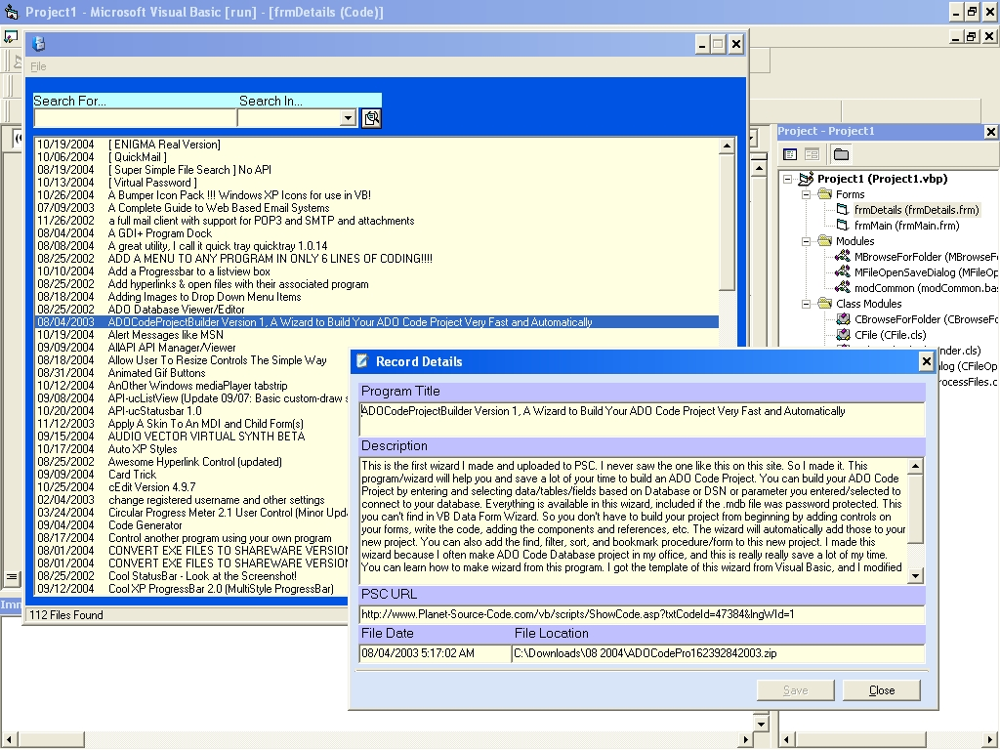



## PSC Downloads

### Description

Over the years I've collected quite a few code and program examples. The problem is that I may know I have an example of how to do something, but I can't find it. This program will open a downloaded file and parse the PSC-readme file, then insert the information into a database that can then be search on. I hope you enjoy it. Please read the readme file prior to running the code as there is a free dll that must be downloaded from another site first.
 
### More Info
 

             |
---                |---
**Submitted On**   |2004-10-27 09:55:16
**By**             |[GettingOld](https://github.com/Planet-Source-Code/PSCIndex/blob/master/ByAuthor/gettingold.md)
**Level**          |Intermediate
**User Rating**    |4.9 (34 globes from 7 users)
**Compatibility**  |VB 5\.0, VB 6\.0
**Category**       |[Complete Applications](https://github.com/Planet-Source-Code/PSCIndex/blob/master/ByCategory/complete-applications__1-27.md)
**World**          |[Visual Basic](https://github.com/Planet-Source-Code/PSCIndex/blob/master/ByWorld/visual-basic.md)
**Archive File**   |[PSC\_Downlo18109910272004\.zip](https://github.com/Planet-Source-Code/gettingold-psc-downloads__1-56959/archive/master.zip)

